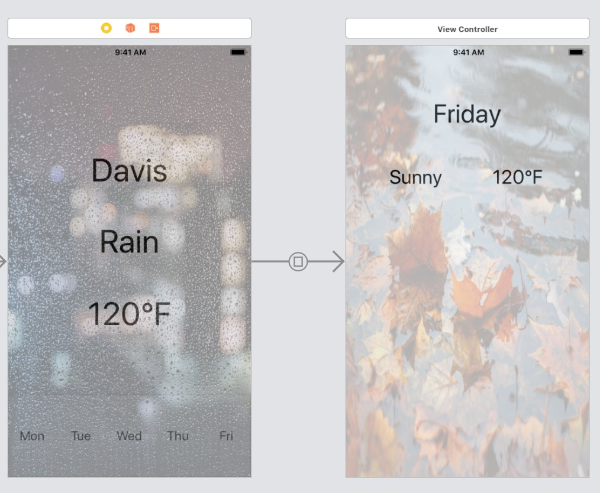

# SprintNote 1
November 19th, 2018

## Trello Board Link
https://trello.com/b/FEhpeJil/ecs189-project

### Weiran Guo:
#### What I did before this meeting
First, I created a group named "Weather" inside the utilityApp, I created WeatherAPI.swift
Then, by using the weather API, Dark Sky suggested by prof, I used GET to make a APICall, and save the returned json file.
Then, I extracted some weather information from the json list and stored them inside the Weather class.

#### What I plan to do
I need to add asyncronization such that my team members can use my WeatherAPI outside the file. Currently they are now focusing on UI design and displaying weather data.

Currently I am using my own GPS information for the weather API Call, I need to finish GPS locating and make it detect the user location automatically.

Add notification for the App. Inform the user the weather when they are not using the App.

#### Issues I have
There are a lot of data inside json list, I need to categorize them and select useful data and make them available to API Caller.

### Yuanbo Li:
(1) What I did in the past a few days:
I implemented a view controller that displays detailed information of single day. For this view controller, I implemented a vertically scrollable UICollectionView, and specialized UICollectionViewCell displaying weather information for this project. Further I finished a delegate for the collection view to update the weather information.

The github commit link is: https://github.com/ECS189E/utilityApp/commit/c7a6b34d183de3181bd1f96766e6945f4316fb50

(2) What I plan to do in the following week:
I plan to refine the UI of the detailed weather diaplay view controller, integrate it with weather API implemented by Weiran Guo.
In addition, I will also design how to utilize the weather information to give users more useful advices.

I plan to merge the starting view implemented by Jack Feng with my view controller into the same storyboard in the master rather than in different branches. Also implement segues between these view controllers.

(3) Issues I get stuck
Currently not sure how to groups different kinds of cells into sections, still try to figure it out.

Also try to come up with the idea how I can dynamically change the other components of a view controller when scrolling collection view.

## Jack Feng:
### What I did before this meeting
First, I implemented a UI of weather information. 

 
 
The next step is to focus on the display of the weather data.
 
 
The github commit link is :https://github.com/ECS189E/utilityApp/commit/493b0547bb276b9aa185f13842147c66789a4dbe
  and : https://github.com/ECS189E/utilityApp/commit/4787692cc0a934b9926a618e83885d6c38ea5635

### What I plan to do
I have to first solve the display problem existing in the UI constraint to make sure it run well. 
Then I want to improve the UI, and display the weather data with a informative design. 
Add some part in the detailed weather view controller

### Issues I have
There are a lot of problems with the constraint in the design and the scroll view does not work well. So I'm thinking about using collection view or make it works. 
The design, according to the response of my teammates, is not good enough.  
I need to cooperate with the back-end to make sure displaying correctly the weather information from the data.
