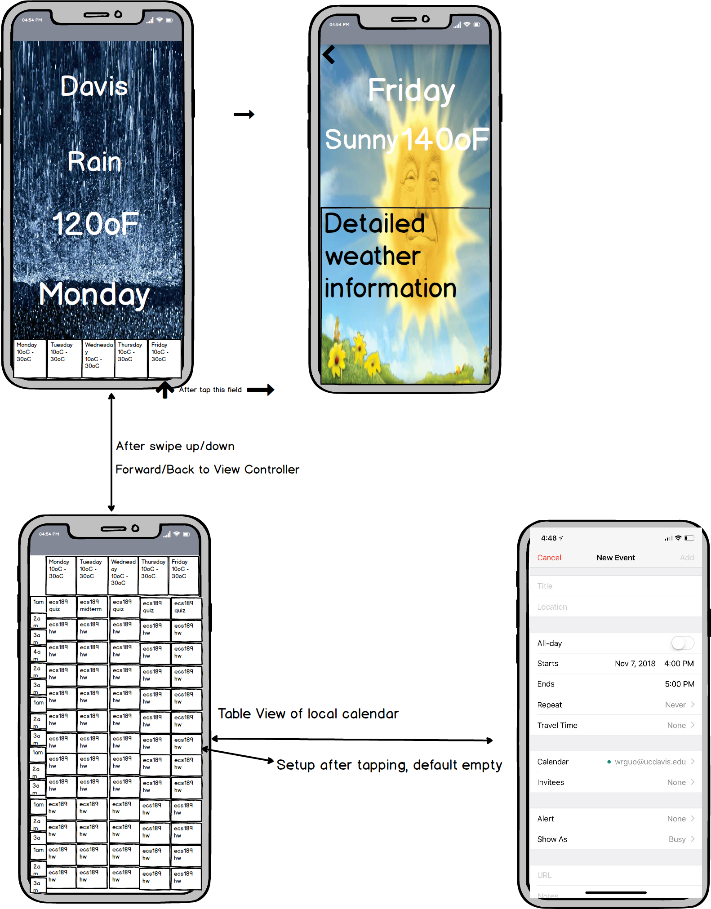

## Milestone 1
### View Design
We plan and design some main view controllers for our application:  

### Third Party Libraries
Kanna: HTML parsing library
Alamofire: HTTP request library

### Model
We plan to implement a model provide weather parsing utility.
We also need a weather model to store the weather information for a single day.
Also need to a task model for calender view to store a task related info.

### Server
no server is needed in this project, we do parsing in from user client.

### View Controllers
#### Main Weather view controller: 
The entry of the program, displays the weather info at current location and current time. Also have brief info about weathers in the following week.
need to collect user location and time when openning and parse the needed info from internet.

#### Detailed Weather view controller:
After user click on a specific day, the app goes into this view to display detailed infomation user may want to know. Usually it is for a single day.

#### Calender view controller:
When user scroll the screen down, it should hide the weather info and display user's schedule for the corresponding days.

#### Task Management view controller:
when user click on a time block, the app should go to the task management view to provide users functionality to add or remove task planned.

#### Others:
It should also provide functionalities for users to facilitate the time management. Such as providing to-do list, write memo, set up alarm clock or reminder etc.

### Timeline
11.11-11.20 finish 4 main view controller implementation
11.21-11.27 finish parsing functionality and basic interaction between view controllers
11.28-12.6 enrich detailed functionalities of this applications, refine the UI design, perform testing.

### Testing Plan
plan to survey 10 users for user experience, collect advises and implement demands that we are lacking.

